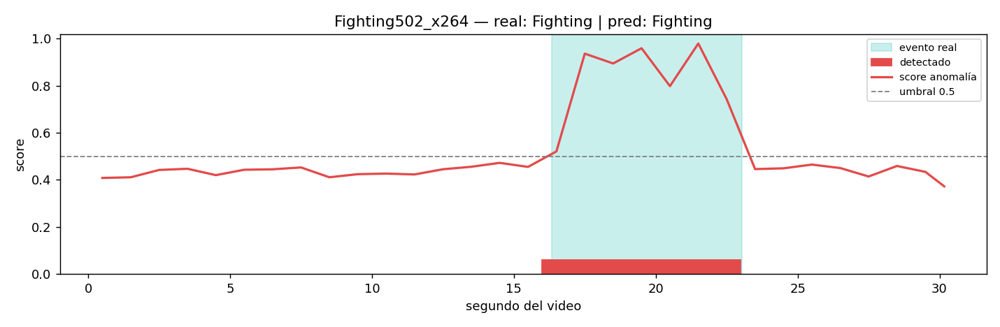

# Detección y localización temporal de anomalías en video — UCF-Crime (3 clases)

Para cada video de vigilancia el sistema responde dos preguntas:

1. **¿Qué pasa?** Clasifica el video en `NormalVideos`, `Fighting` o `Vandalism`.
2. **¿Cuándo pasa?** Da un score de anomalía por segundo y los intervalos del evento, por ejemplo `16.0–23.0 s`.

El entrenamiento solo usa la etiqueta del video completo (MIL débilmente supervisado). La localización se
evalúa con las anotaciones temporales oficiales del test de UCF-Crime.


*Ejemplo con datos sintéticos del smoke test: score por segundo, umbral e intervalo detectado vs evento real.*

---

## Cómo funciona

```
ETAPA 1 · vad extract (una vez)            ETAPA 2 · vad train (rápido, sobre features)
───────────────────────────────            ────────────────────────────────────────────
todos los frames del video                 features por frame
  ├─ RGB      → ConvNeXt-Small (congelado)   → snippets de 3 frames (≈1 s, promedio)
  └─ |Δframe| → ConvNeXt-Tiny  (congelado)   → 32 segmentos por video (promedio de snippets)
  = features por frame (.npz)                → cabeza v5: Transformer + attention pooling
                                             → clase del video + score por posición
```

Hay cuatro unidades temporales, y cada una tiene un solo papel:

| Unidad | Qué es | Para qué |
|---|---|---|
| **Frame** | Una imagen extraída (≈0.33 s) | Materia prima; se procesan **todos** |
| **Snippet** | Promedio de 3 frames seguidos (≈1 s) | Unidad que se puntúa → **resolución temporal** |
| **Segmento** | Promedio de los snippets de 1/32 del video | Solo **entrenamiento** (todos los videos quedan del mismo tamaño) |
| **Ventana** | 32 snippets consecutivos que avanzan de 16 en 16 | Solo **inferencia** (el Transformer ve 32 posiciones a la vez) |

**Inferencia de un video de 2 min.** Son 360 frames → 120 snippets. Con ventanas de 32 y paso 16 hay 7
ventanas (inicios 0, 16, 32, 48, 64, 80 y 88; la última se alinea al final). Cada ventana puntúa sus 32
snippets, y donde las ventanas se solapan se promedia. Resultado: 120 scores, uno por segundo.

**Pérdida.** Se conservan los términos de v5 (CE del video, entropía de la atención, CE del segmento top y
suavidad de la atención) y se agregan los de Sultani et al. (2018): *ranking* (el snippet más anómalo de un
video anómalo debe superar al más anómalo de un video normal), *sparsity* y suavidad del score. Cada batch
lleva mitad videos normales y mitad anómalos. El score por posición es `s = 1 − P(Normal)`.

---

## Estructura

```
configs/default.yaml               # única fuente de rutas e hiperparámetros
data/raw/                          # frames originales (no versionados)
data/processed/                    # splits + features .npz (no versionados)
data/manifests/                    # hashes/versiones del dataset (*.json versionados)
docs/DATASET.md                    # documentación del dataset (autocompletada por vad ingest)
notebooks/01_exploracion_dataset.ipynb
src/vad/
  cli.py                           # comando `vad`
  data/ingest.py · preprocess.py   # datos crudos → splits train/val/test
  features.py                      # etapa 1: extracción con backbones congelados
  data/feature_dataset.py          # segmentos + batches balanceados
  temporal.py                      # snippets, segmentos, ventanas, frames ↔ segundos
  models/mil_head.py               # cabeza v5 + score por snippet
  train.py · inference.py · evaluate.py · localize.py
tests/                             # pytest: pipeline de datos, lógica temporal, smoke MIL
legacy/                            # scripts originales (v2.1, v5) solo como referencia
```

## 1. Instalación

```bash
python -m venv .venv
.venv\Scripts\activate            # Windows  (Linux/Mac: source .venv/bin/activate)
pip install torch torchvision --index-url https://download.pytorch.org/whl/cu121   # ajusta tu CUDA
pip install -r requirements.txt
pip install -e .
vad --help
```

## 2. Datos
**Fuente:** UCF-Crime Dataset [1], Center for Research in Computer Vision (CRCV), University of Central Florida.
Página oficial: https://www.crcv.ucf.edu/projects/real-world/

De ahí se obtienen los videos y el archivo de anotaciones temporales del test. Los frames se ubican así:

```
data/raw/ucf_crime/Train/<Categoria>/<VideoID>_<frame>.png
data/raw/ucf_crime/Test/<Categoria>/<VideoID>_<frame>.png
data/raw/Temporal_Anomaly_Annotation_for_Testing_Videos.txt     # necesario para medir el "cuándo"
```

## 3. Ejecución de inicio a fin

```bash
vad pipeline --download-date AAAA-MM-DD   # ingesta (hash, manifest) + preprocesamiento (splits)
vad extract                               # features de TODOS los frames (una vez; reanudable)
vad train                                 # cabeza MIL; mejor modelo por macro-F1 de validación
vad evaluate                              # test ciego: métricas por video + AUC por frame
vad localize --plot-all                   # intervalos en segundos + gráfico por video anómalo
vad localize --video-id Fighting003_x264  # un video puntual
```

Cada comando deja un log en `logs/<paso>_<fecha>.log`.

| Paso | Salida principal |
|---|---|
| `pipeline` | `data/manifests/*_version.json`, `data/processed/ucf_crime_3class/splits/*.jsonl` |
| `extract` | `data/processed/features/convnext_s_t_diff/<video>.npz` + `index.json` |
| `train` | `artifacts/checkpoints/best_model.pth`, `history.csv` |
| `evaluate` | `artifacts/reports/test/metrics.json`, `predictions.csv`, `confusion_matrix.png`, `roc_curves.png`, `frame_roc.png` |
| `localize` | `artifacts/reports/localization_test/summary.csv`, `snippets.csv`, `metrics.json`, `<video>.png` |

## 4. Métricas

| Nivel | Métrica | Pregunta que responde |
|---|---|---|
| Video | Accuracy, P/R/F1 por clase, macro AUC | ¿qué tipo de evento? |
| Frame | **AUC frame-level** (estándar de UCF-Crime), AP | ¿el score sube en los frames correctos? |
| Evento | tIoU medio, % videos con tIoU ≥ 0.5, % normales con falsa alarma | ¿el intervalo detectado coincide con el real? |

> El AUC por frame se calcula sobre el subconjunto de 3 clases, tras los filtros de calidad (sin Arrest,
> RoadAccidents, Shooting ni videos oscuros). **No es directamente comparable** con los valores publicados
> sobre UCF-Crime completo.

## 5. Parámetros clave (`configs/default.yaml`)

| Clave | Default | Efecto |
|---|---|---|
| `snippet.frames_per_snippet` | 3 | Resolución: 3 frames ≈ 1 s. Con 1 → 0.33 s (curva más ruidosa) |
| `mil.num_segments` | 32 | Segmentos por video en entrenamiento |
| `mil.window` / `mil.stride` | 32 / 16 | Ventana deslizante en inferencia |
| `localize.threshold` | 0.5 | Score mínimo para marcar un snippet como anómalo |
| `train.lambda_*` | ver archivo | Pesos de cada término de la pérdida (0 = desactivado) |

## 6. Reproducibilidad

- Semillas fijas.
- Hash del dataset crudo, del procesado y de la configuración de features (`index.json`).
- Cada checkpoint guarda la config y la versión de datos con la que se entrenó.
- Para fijar el entorno: `pip freeze > requirements-lock.txt`.

## 7. Tests

```bash
pytest
```

Cubren tres partes:
- Ingesta y preprocesamiento sobre datos sintéticos, incluyendo ausencia de fuga entre splits y determinismo de los hashes.
- La lógica temporal, por ejemplo que 120 snippets dan exactamente 7 ventanas.
- Un smoke test de train → evaluate → localize.

## 8. Limitaciones

- La resolución temporal está limitada por el snippet (≈1 s) y por la tasa de extracción de frames (≈3 fps).
- Sin augmentación: las features se extraen una vez sin transformaciones. v5 aplicaba augmentación sobre frames.
- Train/val no tienen anotación temporal, así que el umbral y el modelo se eligen sin ver la localización; el "cuándo" solo se mide en test.
- En entrenamiento el Transformer ve segmentos de ~1/32 del video y en inferencia snippets de ~1 s: hay un cambio de escala temporal entre ambos.
- `Vandalism` agrupa eventos heterogéneos.

## 9. Ética

Uso académico. UCF-Crime contiene personas identificables; no redistribuir frames.
